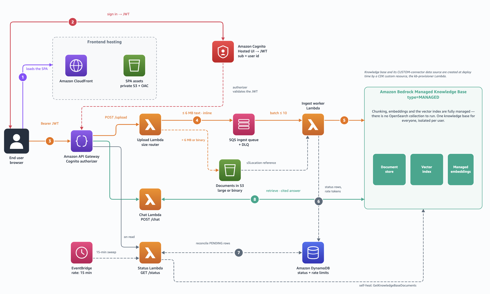

# Multi-Tenant Agentic Document Chat with Amazon Bedrock Managed Knowledge Base

This sample is the companion code for the AWS blog post [Build multi-tenant agentic chat applications on enterprise data with Amazon Bedrock Managed Knowledge Base](https://aws.amazon.com/blogs/machine-learning/TODO-REPLACE-WITH-FINAL-URL).

Upload a document, then ask questions about it. The application uses **Amazon Bedrock Managed Knowledge Base** for ingestion, storage, and agentic retrieval — no vector store to provision or manage. Each user's documents are isolated through metadata filtering on the authenticated identity.

## Architecture



The solution consists of:

| Component | Purpose |
|-----------|---------|
| **Amazon Bedrock Managed Knowledge Base** | Stores, chunks, embeds, indexes, and retrieves documents. A custom connector data source enables direct ingestion. |
| **Amazon API Gateway + AWS Lambda** | Exposes `/upload`, `/status`, and `/chat` endpoints. |
| **Amazon Cognito** | Authenticates users; the verified JWT `sub` is the per-user isolation key. |
| **Amazon SQS** | Decouples uploads from ingestion; absorbs bursts; routes failures to a DLQ. |
| **Amazon DynamoDB** | Tracks document indexing status (PENDING → INDEXED → FAILED). |
| **Amazon S3** | Stages files larger than 6 MB; hosts the SPA behind CloudFront. |

### How it works

1. A user signs in through Cognito and uploads a document. API Gateway validates the JWT.
2. The upload Lambda enqueues an ingestion job to SQS and returns immediately.
3. The ingest worker reads from the queue, attaches the user's identity as metadata, and calls `IngestKnowledgeBaseDocuments`.
4. Document status is tracked in DynamoDB and surfaced in the UI.
5. To ask a question, the user sends a message to the `/chat` endpoint.
6. The chat Lambda calls `AgenticRetrieveStream` with an explicit filter on `user_id`, and streams back a cited answer.

### Per-user isolation

Every document is tagged with the caller's Cognito `sub` at ingest time. Every retrieval call includes an explicit `equals` filter on that value — built server-side from the verified JWT, never from the request body. This is the security boundary.

## Project structure

```
04-bmkb-agentic-chatapplication/
├── deploy/                 # CDK v2 stack (Managed KB, API GW, Lambdas, SQS, DynamoDB, S3, CloudFront, Cognito)
├── docs/                   # Detailed technical documentation (architecture, API, security)
├── frontend/               # React + Vite + Tailwind
└── lambda/
    ├── common/             # @bmkb/common — shared contracts + helpers
    ├── upload/             # POST /upload
    ├── ingest-worker/      # SQS → IngestKnowledgeBaseDocuments
    ├── chat/               # POST /chat (AgenticRetrieveStream)
    └── status/             # GET /status
```

## Prerequisites

- **Node.js 20** (`.nvmrc` included — run `nvm use`)
- **AWS credentials** with permissions for CloudFormation, Lambda, S3, SQS, DynamoDB, Cognito, CloudFront, Bedrock, IAM
- Region defaults to `us-west-2`; override with `AWS_REGION`

## Getting started

### 1. Build locally

All commands below run from this directory, so change into it first:

```bash
git clone https://github.com/aws-samples/amazon-bedrock-samples.git
cd amazon-bedrock-samples/rag/managed-knowledge-bases/03-use-case-example/04-bmkb-agentic-chatapplication

nvm use
npm ci
npm run build
```

### 2. Deploy

```bash
cd deploy
npx cdk bootstrap          # once per account/region
npm run deploy
```

This single command builds the frontend, deploys the full stack, uploads the SPA to CloudFront, and writes the runtime `config.json` from stack outputs. When it finishes, open the `CloudFrontUrl` output in your browser.

Deployment takes approximately 6–7 minutes (the Managed KB needs no vector store to provision).

### 3. Create a test user

Cognito self-sign-up is enabled by default — users can register through the hosted UI. You can also create test users via the CLI:

```bash
POOL=<UserPoolId from deploy output>
CLIENT=<UserPoolClientId from deploy output>

aws cognito-idp admin-create-user \
  --user-pool-id "$POOL" --username alice@example.com \
  --message-action SUPPRESS

aws cognito-idp admin-set-user-password \
  --user-pool-id "$POOL" --username alice@example.com \
  --password 'Test-Passw0rd!' --permanent
```

Then open the CloudFront URL, sign in, upload a document, and start chatting.

### 4. Tear down

```bash
cd deploy
npm run destroy
```

All resources are removed cleanly (buckets, tables, queues, Cognito pool, KB).

## Key design decisions

- **Native CloudFormation** — The Knowledge Base and data source are provisioned using `AWS::Bedrock::KnowledgeBase` (with `type: MANAGED`) and `AWS::Bedrock::DataSource` L1 constructs directly.
- **Direct ingestion (custom connector)** — Documents are ingested inline through `IngestKnowledgeBaseDocuments` rather than the S3 connector, so uploads become retrievable in seconds without a sync job. For bulk migrations of an existing corpus, use the S3 connector with a scheduled sync instead.
- **Single KB, multi-tenant** — One shared knowledge base with metadata-based isolation, rather than a KB per tenant. Retrieval scales easily (the ingestion path is the bottleneck, not retrieval).
- **Agentic retrieval** — `AgenticRetrieveStream` handles query decomposition, multi-hop retrieval, and answer generation in a single API call with per-user filtering applied to every sub-query.

## Related resources

- [Amazon Bedrock Knowledge Bases documentation](https://docs.aws.amazon.com/bedrock/latest/userguide/knowledge-base.html)
- [Amazon Bedrock pricing](https://aws.amazon.com/bedrock/pricing/)
- [IngestKnowledgeBaseDocuments API reference](https://docs.aws.amazon.com/bedrock/latest/APIReference/API_agent_IngestKnowledgeBaseDocuments.html)

## Security

See [CONTRIBUTING](CONTRIBUTING.md#security-issue-notifications) for more information.

## License

This library is licensed under the MIT-0 License. See the [LICENSE](../../../../LICENSE) file.
